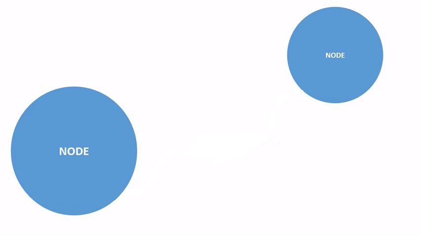
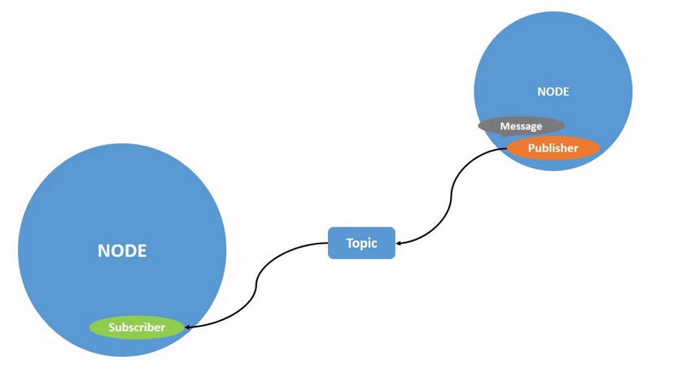
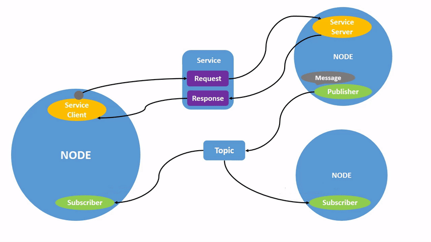

# ROS Introduction

## Requirements

- Ubuntu  
  _22.04 LTS preferred_
- Installed [ROS Humble](https://docs.ros.org/en/humble/Installation/Ubuntu-Install-Debs.html)
- Clion
- Unix shell understanding  
  _ex. Bash_
- <span style="color:#90EE90">C++</span> / <span style="color:#FF6666">Python</span>
- Basic cmake

---

## Tutorials

ROS has excellent official [tutorials](https://docs.ros.org/en/humble/Tutorials.html).  
The best way to approach the tutorials is to walk through them for the first time in order, as they build off of each other and are not meant to be comprehensive documentation.  
If you use some package from tutorial and want your package to have similar functionality - you can always search for it in ROS github, for [example](https://github.com/ros/ros_tutorials).

---

## ROS quick description

The Robot Operating System (ROS) is a set of software libraries and tools that help you build robot applications.   
From drivers to state-of-the-art algorithms, and with powerful developer tools, ROS has what you need for your next
robotics project.   
And it's all open source.
---

# ROS Infrastructure

## Checkup of setup

bashrc  
.bashrc is a Bash shell script that Bash runs whenever it is started interactively.

```bash
  nano ~/.bashrc
```

Add in the end of bashrc file

```bash
  source /opt/ros/humble/setup.bash 
  source ~/ros2_ws/install/local_setup.bash
```

## Workspace

### Theory

#### File Structure

* src  
  _Folder for sources (packages)_

* build  
  _Folder for build objects_

* install  
  _Folder for installed objects that are ready for distribution and deployment_

* log  
  _Logs, you don't need it for now_

### Creation using CLI

```bash
  mkdir ~/ros2_ws
  cd ~/ros2_ws
  mkdir src
```

---

## Package

### Theory

A [package](https://docs.ros.org/en/humble/Tutorials/Beginner-Client-Libraries/Creating-Your-First-ROS2-Package.html) is
an organizational unit for your ROS 2 code.

### Package filestructure

* src (and **include** only for headers)  
  _Folder for code_

* launch  
  _Folders for all python launch files_

* package.xml  
  _This file defines properties about the package such as the package name, version numbers, and dependencies on other
  colcon packages_

* CMakeLists.txt  
  _Contains a set of instructions describing the project's source files and targets (executable or library)._

### Creation using CLI

```bash
cd ~/ros2_ws/src
ros2 pkg create demo_package --build-type ament_cmake --node-name demo_node 
```

---

## Build System

Build system of ROS is called **colcon**

### Colcon installation

```bash
sudo apt install python3-colcon-common-extensions
```

### Building existing package with colcon

```bash
cd ~/ros2_ws
colcon build
```

### TIP

If build fails for some strange reason - try *clean* build. It will regenerate all build
files and sometimes fix error.

```bash
rm -rf ~/ros2_ws/build
rm -rf ~/ros2_ws/install
```

<span style="color:#FF6666">Dont delete src, please!</span>

---

# Internals of ROS

## Node

### Theory

Each node in ROS should be responsible for a single, modular purpose,   
e.g. controlling the wheel motors or publishing the sensor data from a laser range-finder.   
Each node can send and receive data from other nodes via topics, services, actions, or parameters.

### Scheme



### Example

[demo_node.cpp](src%2Fdemo_package%2Fsrc%2Fnode%2Fdemo_node.cpp)

### Launch using CLI

```bash
cd ~/ros2_ws
colcon build
source install/local_setup.bash
ros2 run demo_package demo_node
```

### Spin

Spin refers to the process of continuously checking for and processing incoming data (e.g., messages, service requests,
or timers) for a node.  
<span style="color:#FF6666">If your subscriber or server doesn't receive messages - check if it is being spinned.</span>

```c++
auto node = std::make_shared<rclcpp::Node>("node_name");

// infinite spin
rclcpp::spin(node);

// spin all avaliable callbacks
rclcpp::spin_some(node);
```

### CLI tracing

```bash
ros2 node list
```

```bash
ros2 node info /demo_node_instance
```

---

## Launch System

Launch system is needed to automate launching and configuring nodes.  
It's written using python.

### Example python code

This example launches node "demo_node" from package "demo_package" and gives it name "demo_node_instance_name"

```python
from launch import LaunchDescription
from launch_ros.actions import Node


def generate_launch_description():
    return LaunchDescription([
        Node(
            package='demo_package',
            executable='demo_node',
            name='demo_node_instance_name'
        )
    ])

```

### Actually launching nodes

#### Launching single Node
[node_one.py](src%2Fdemo_package%2Flaunch%2Fnode_one.py)
```bash
cd ~/ros2_ws
colcon build
ros2 launch ~/ros2_ws/src/demo_package/launch/node_one.py
```

#### Launching multiple Nodes
[node_multiple.py](src%2Fdemo_package%2Flaunch%2Fnode_multiple.py)
```bash
cd ~/ros2_ws
colcon build
ros2 launch ~/ros2_ws/src/demo_package/launch/node_multiple.py
```

---

## Pub/Sub

[Publishers and subscribers](https://docs.ros.org/en/foxy/Tutorials/Beginner-Client-Libraries/Writing-A-Simple-Cpp-Publisher-And-Subscriber.html)
are used for communication between nodes.  
A node may publish data to any number of topics and simultaneously have subscriptions to any number of topics.

### Messages

Data, that is being sent using pub-sub is called "message".  
You can use default messages, or you can create your own types.

### Topics
You can think about topic as channel for publisher and subscriber.  
Every topic has unique name and can send/receive only ONE type of message.



### Example

[demo_subscriber.cpp](src%2Fdemo_package%2Fsrc%2Fpubsub%2Fdemo_subscriber.cpp)

```bash
cd ~/ros2_ws
colcon build
ros2 run demo_package demo_subscriber
```

```bash
ros2 topic list
ros2 topic info /demo/pubsub
ros2 topic echo /demo/pubsub 
```

```bash
ros2 topic pub /demo/pubsub std_msgs/msg/String "{ data: 'This was called from CLI' }"
```

[demo_publisher.cpp](src%2Fdemo_package%2Fsrc%2Fpubsub%2Fdemo_publisher.cpp)  

```bash
cd ~/ros2_ws
colcon build
ros2 run demo_package demo_publisher
```

[pubsub.py](src%2Fdemo_package%2Flaunch%2Fpubsub.py)

```bash
cd ~/ros2_ws
colcon build
ros2 launch ~/ros2_ws/src/demo_package/launch/pubsub.py
```

### CLI tracing

```bash
rqt_graph
```

---

## Custom messages

Better use external package for messages so your main package won't become huge mess

### Creation of DTO package

```bash
cd ~/ros2_ws/src
ros2 pkg create demo_dto --build-type ament_cmake
```

Create Message [.msg file](src%2Fdemo_dto%2Fmsg%2FArmState.msg):
```bash
mkdir ~/ros2_ws/src/demo_dto/msg
cd ~/ros2_ws/src/demo_dto/msg
nano ArmState.msg
```
```rosinterface
bool connected
string ip
float64 velocity
float64[7] positions
```

Create Service's Request-Response [.srv file](src%2Fdemo_dto%2Fsrv%2FAddition.srv)
```bash
mkdir ~/ros2_ws/src/demo_dto/srv
cd ~/ros2_ws/src/demo_dto/srv
nano Addition.srv
```
```rosinterface
float64 a
float64 b
---
float64 c
```

In [package.xml](src%2Fdemo_dto%2Fpackage.xml) insert dependencies for generating messages

```xml
<build_depend>rosidl_default_generators</build_depend>
<exec_depend>rosidl_default_runtime</exec_depend>
<member_of_group>rosidl_interface_packages</member_of_group>
```


In that package [CMakeLists.txt](src%2Fdemo_dto%2FCMakeLists.txt) you add:

```cmake
cmake_minimum_required(VERSION 3.8)
project(demo_dto)

find_package(ament_cmake REQUIRED)
find_package(builtin_interfaces REQUIRED)
find_package(rosidl_default_generators REQUIRED)

rosidl_generate_interfaces(demo_dto
        "msg/ArmState.msg"
        "srv/Addition.srv"
        DEPENDENCIES builtin_interfaces
)

ament_package()
```


### Adding it as dependency to your main package

In main package file [package.xml](src%2Fdemo_package%2Fpackage.xml) add:

```xml
<build_depend>demo_dto</build_depend>
```

In [CMakeLists.txt](src%2Fdemo_package%2FCMakeLists.txt) add:
```cmake
find_package(demo_dto REQUIRED)

#...

ament_target_dependencies(NODE_NAME ... demo_dto)

```

---

## Service ( Server / Client )

### Theory

[Services](https://docs.ros.org/en/humble/Tutorials/Beginner-CLI-Tools/Understanding-ROS2-Services/Understanding-ROS2-Services.html) 
are based on a call-and-response model versus the publisher-subscriber model of topics.  
While topics allow nodes to subscribe to data streams and get continual updates, services only provide data when they are specifically called by a client.


### Example

[demo_service.cpp](src%2Fdemo_package%2Fsrc%2Fservice%2Fdemo_service.cpp)  

```bash
cd ~/ros2_ws
colcon build
ros2 run demo_package demo_server
```

```bash
ros2 service call /demo/service demo_dto/srv/Addition "{ a: 3.5, b: 5.3 }"
```

[demo_client.cpp](src%2Fdemo_package%2Fsrc%2Fservice%2Fdemo_client.cpp)  
[service.py](src%2Fdemo_package%2Flaunch%2Fservice.py)
```bash
cd ~/ros2_ws
colcon build
ros2 launch ~/ros2_ws/src/demo_package/launch/service.py
```

### CLI tracing

```bash
ros2 service list
```

---

## Summary



---

# Homework

1. [Create workspace](https://docs.ros.org/en/humble/Tutorials/Beginner-Client-Libraries/Creating-A-Workspace/Creating-A-Workspace.html)
2. [Create package](https://docs.ros.org/en/humble/Tutorials/Beginner-Client-Libraries/Creating-Your-First-ROS2-Package.html)
3. [Create pubsub](https://docs.ros.org/en/humble/Tutorials/Beginner-Client-Libraries/Writing-A-Simple-Cpp-Publisher-And-Subscriber.html)
4. [Create service](https://docs.ros.org/en/humble/Tutorials/Beginner-Client-Libraries/Writing-A-Simple-Cpp-Service-And-Client.html)
5. [Create and use custom message](https://docs.ros.org/en/humble/Tutorials/Beginner-Client-Libraries/Custom-ROS2-Interfaces.html)  
